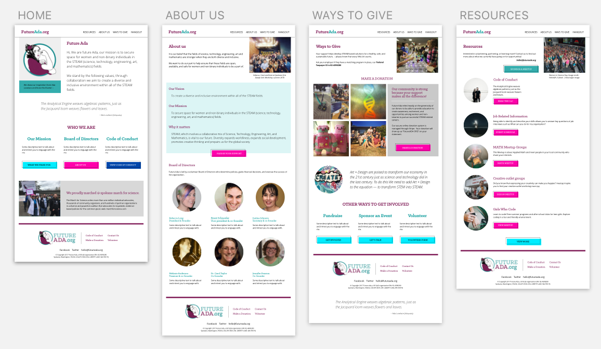

# Week 7 Assignment

Your assignment for this week is to think of a capstone project idea and create a plan for the project.

## Capstone Project Requirements

* The project must be a React application, bootstrapped with `create-react-app`
* Your app must be created and visible in a Github repo under your Github account
* Your app must be your own work. You may have a partner if you'd like, but be aware that you'll need to come up with a strategy for working together. Most developers on small projects create branches for new features/fixes, then merge them back into the `master` branch. Merge conflicts can arise, and you'll need to know how to resolve them.
* Your app should be deployed onto a web server and publicly accessible
* Your app should be polished. Some recommendations for this requirement:
  * Remove `console.log` statements once you're finished with development
  * Utilize CSS and images to make your app look great
  * Check for any React errors in the console
  * Perform some basic user testing. Have other people use your app and receive feedback on usability
  * Keep your feature set small, so you'll have time to polish the app

Other than the above requirements, you're encouraged to be creative and create something you're proud of. It can be as simple or as complex as you want, and it should be high quality.

## Assignment Requirements

Above are the requirements for the project. For this week however, you'll need to create a plan for your project. More details are to come, but you'll need to create a pull request with the following:

# Project Codename: Future Ada
Future Ada is a non-profit startup, focusing on Securing space for women and non-binary individuals in the STEAM fields.

### 📝 Wireframes

★ [View high-fidelity composition on InVision](https://invis.io/BRKX7C0U4GS#/303030945_HOME)

### 🐙 Dependencies
* Create React APP using `npm install -g create-ceact-app`
* [react-twitter-widgets](https://www.npmjs.com/package/react-twitter-widgets) using `npm install --save react-twitter-widgets`

### 🦉 Task List

A list of tasks that need to be completed for your project.
- [ ] Setup `create-react-app` scaffold add BrowserRouter 
- [ ] Render React state
- [x] Design Wireframe layout
- [x] Develop Content for pages
- [ ] Create design patterns html css
- [ ] Develop page components
- [ ] Pull twitter news feed
- [ ] Setup VPS environment
- [ ] Deploy to server via git

#### Bonus
* Connect to facebook to pull realtime events

